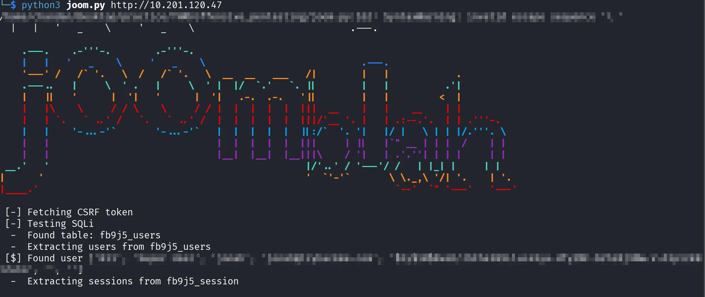

------------------------------------------TASK - 1------------------------------------------
1.1 Deloy the Machine

Q1: Access the Web-Server, who robbed the bank? 
Steps:

- Go to the target machine IP address in your browser and access the web page.
- In the Home page itself you can find the answer for the question.

------------------------------------------TASK - 2------------------------------------------
2.1 Obtain User and Root privileges
Steps:

- Enumerate the home page using the gobuster, dirsearch, etc..
- For gobuster:
    gobuster dir -u http://MACHINE_IP/ -w /usr/share/wordlists/dirbuster/directory-list-2.3-medium.txt -t 50 > dir_enum.txt
- For dirsearch:
    dirsearch -u http://MACHINE_IP/
- The administrator page will be present and then redirect to the administrator page using http://MACHINE_IP/administrator

- The administrator login page will be present.

Q2: What is the Joomla version?
Steps:

- Use joomscan to scan the joomla vulnerabiltiy and version.
- After finding the joomla version, search in the terminal using searchsploit joomla x.x.x (version) or google it.

- Then copy it to the current directory usign searchsploit -m
- Then read that file and there will be solution to get the database table, username and password using the sqlmap.
- Using sqlmap and with that type of payload it will take more time to fetch the credentials.
- Instead use joomla python script to fetch the credentials (https://github.com/stefanlucas/Exploit-Joomla/blob/master/joomblah.py).

- The password will be encrypted using the bcrypt algorithm.
- Crack it using the john the ripper.
    john — format=bcrypt — wordlist=/usr/share/wordlists/rockyou.txt pass.txt
- After getting the password and username login using the same credentials in the administrator page.

- Then you will be redirected to http://MACHINE_IP/administrator/index.php and go to Templates page.
- In the templates page choose protostar because it is the default for all pages.

- Then click on New File.

- In you terminal, search for the php-reverse-shell and copy it to your current directory.

- Then edit and replace the IP address to your attacker IP address and save it.
- Then in the File name give any name and extension as php and click create..

- Copy and Paste the php-reverse-shell that you have edited in the attacker machine and save it.

- Note that the shell.php is in http://MACHINE_IP/templates/protostar/shell.php
- Now in the attacker machine start the nc -nlvp 1234 (whichever port you have given) listener.

- Then go the that link http://MACHINE_IP/templates/protostar/shell.php and you will get access to the shell.

- Then
    python -c ‘import pty; pty.spawn(“/bin/bash”)’
    export TERM=xterm-256color
  for interactive TTY.
- Go to home/jjameson, but access gets denied because still you don’t have the super user access.
- You can use linpeas.sh to search for the vulnerabiltiy.
- Instead go to /var/www/html and look out for configuration.php and look inside for the credentials.

- Then login as su user using the credentials.

- Go inside the jjameson directory and read the user.txt file.

- Now to get a Root privileges first see the jjameson privileges using sudo -l

- Go to gtfobins search yum and then go to sudo.

- Use the below plugins.

- Paste this plugin into the reverse shell terminal.

- Now you got the root privileges

- Go to root/ and read the root.txt file to get the answer to the challenge.

----------------------------------------------------------QUESTION AND ANSWERS----------------------------------------------------------

What is the Joomla version?
3.7.0

What is Jonah’s cracked password?
spiderman123

What is the user flag?
27a260fe3cba712cfdedb1c86d80442e

What is the root flag?
eec3d53292b1821868266858d7fa6f79

Conclusion:

The Daily Bugle room demonstrates web enumeration, Joomla exploitation, credential cracking, and privilege escalation. By leveraging enumeration tools, exploiting Joomla, and using GTFOBins for privilege escalation, you gain user and root access, showcasing key real-world penetration testing techniques from initial access to full system compromise.

